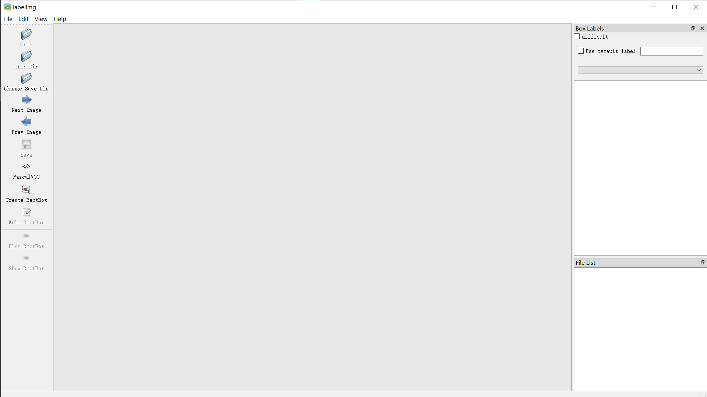
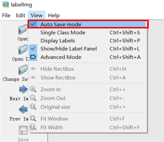
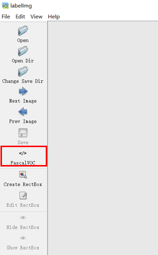

# YOLO Datasets And Training Methods

This project mainly completed the following work:

* It introduces how to make a custom dataset for YOLO and how to train a YOLO model by the custom dataset.
* Some modifications have been made to Yolov5, YOLOV6, Yolov7 and Yolov8, which can be adapted to the custom dataset for training.
* Pre-training weights for the object detection model of YOLO are provided.

## 1. Making Custom Datasets

### （1）Capture images

* If you are using **Intel RealSense** to capture images, you can check this link [Images-Acquisition-With-RealSense](https://github.com/Incalos/Images-Acquisition-With-RealSense).

### （2）Install and launch labelimg

* Open a terminal and enter the following command to complete the installation of **labelimg**.

  ```shell
  pip install labelimg -i https://pypi.tuna.tsinghua.edu.cn/simple
  ```

* Launch **labelimg** by typing `labelimg` in the terminal and the screen will appear as shown below.

  

### （3）Configure the annotation tool

* Find **View** in the menu and click on **Auto Save mode** to set the annotation process to autosave mode.

  

* Select **PascalVOC** to set the format of the dataset.

  

### （4）Annotate the dataset

* It is recommended that the custom dataset be set up in the following directory structure. The **YoloDataSets** is the root directory of the dataset, the folder named **images** contains the images to be annotated, and the folder named **Annotations** contains the labels generated by the annotation tool.

  ```shell
  YoloDataSets/
   |——————images/
   |        └——————1.jpg
   |        └——————2.jpg  
   |        └——————3.jpg
   |        └——————...
   |——————Annotations/
   |        └——————1.xml
   |        └——————2.xml  
   |        └——————3.xml
   |        └——————...
  ```

* Click **Open Dir** and select the folder named **images** to find the images to be annotated.

* Click **Change Save Dir** and select the folder named **Annotations** to save labels annotated by labelimg。

* Start annotating images, the detailed process is as follows.

  

### （5）Convert VOC format to YOLO format

* Save the annotated dataset in the following structure.

  ```shell
  YoloDataSets/
   |——————images/
   |        └——————1.jpg
   |        └——————2.jpg  
   |        └——————3.jpg
   |        └——————...
   |——————Annotations/
   |        └——————1.xml
   |        └——————2.xml  
   |        └——————3.xml
   |        └——————...
  ```
  
* Run **DataSet.py** by typing the following command in the terminal.

  ```shell
  python DataSet.py --yoloversion yolov5 --trainval_percent 0.9 --train_percent 0.9 --mainpath YoloDataSets --classes ['dog','man']
                                  yolov6                    ···                ···             ····                   ['','',···]
                                  yolov7                    ···                ···             ····                   ['','',···]
                                  yolov8                    ···                ···             ····                   ['','',···]
  ```

* The meaning of each parameter in the command is as follows.

  * **yoloversion** : `the version of YOLO, which you can choose YOLOv5, YOLOv6, YOLOv7 and YOLOv8`
  * **trainval_percent** : `the total percentage of the training and validation set`
  * **train_percent** : `the percentage of training set in training set and validation set`
  * **mainpath** : `the root directory of the custom dataset`
  * **classes** : `the name of the label, please fill in the list format according to the example`

## 2. Training Model

### （1）Training method of YOLOv5

* Enter the following command in the terminal to access the folder named **yolov5**.

  ```shell
  cd yolov5
  ```

* Place the converted dataset in the root directory of **yolov5**.

* Add the **.yaml** configuration file named **data.yaml** to the directory of **YoloDataSets** with the following content and format.

  ```
  path : YoloDataSets
  train: train.txt
  val: val.txt
  test: test.txt

  # number of classes
  nc: 2

  # class names
  names: ['dog','man']
  ```

* Run the following command in the terminal, with the parameters adjusted as appropriate.

  ```shell
  python train.py --data YoloDataSets/data.yaml --epochs 300 --weights yolov5n.pt --cfg model/yolov5n.yaml  --batch-size 128
                                                                       yolov5s.pt       model/yolov5s.yaml               64
                                                                       yolov5m.pt       model/yolov5m.yaml               40
                                                                       yolov5l.pt       model/yolov5l.yaml               24
                                                                       yolov5x.pt       model/yolov5x.yaml               16
  ```

* The official pre-training weights for object detection are provided as follows.


  | Model                                                                                | size<br><sup>(pixels) | mAP<sup>val<br>50-95 | mAP<sup>val<br>50 | Speed<br><sup>CPU b1<br>(ms) | Speed<br><sup>V100 b1<br>(ms) | Speed<br><sup>V100 b32<br>(ms) | params<br><sup>(M) | FLOPs<br><sup>@640 (B) |
  | ------------------------------------------------------------------------------------ | --------------------- | -------------------- | ----------------- | ---------------------------- | ----------------------------- | ------------------------------ | ------------------ | ---------------------- |
  | [**YOLOv5n**](https://github.com/ultralytics/yolov5/releases/download/v7.0/yolov5n.pt)   | 640                   | 28.0                 | 45.7              | **45**                       | **6.3**                       | **0.6**                        | **1.9**            | **4.5**                |
  | [**YOLOv5s**](https://github.com/ultralytics/yolov5/releases/download/v7.0/yolov5s.pt)   | 640                   | 37.4                 | 56.8              | 98                           | 6.4                           | 0.9                            | 7.2                | 16.5                   |
  | [**YOLOv5m**](https://github.com/ultralytics/yolov5/releases/download/v7.0/yolov5m.pt)   | 640                   | 45.4                 | 64.1              | 224                          | 8.2                           | 1.7                            | 21.2               | 49.0                   |
  | [**YOLOv5l**](https://github.com/ultralytics/yolov5/releases/download/v7.0/yolov5l.pt)   | 640                   | 49.0                 | 67.3              | 430                          | 10.1                          | 2.7                            | 46.5               | 109.1                  |
  | [**YOLOv5x**](https://github.com/ultralytics/yolov5/releases/download/v7.0/yolov5x.pt)   | 640                   | 50.7                 | 68.9              | 766                          | 12.1                          | 4.8                            | 86.7               | 205.7                  |
  |                                                                                      |                       |                      |                   |                              |                               |                                |                    |                        |
  | [**YOLOv5n6**](https://github.com/ultralytics/yolov5/releases/download/v7.0/yolov5n6.pt) | 1280                  | 36.0                 | 54.4              | 153                          | 8.1                           | 2.1                            | 3.2                | 4.6                    |
  | [**YOLOv5m6**](https://github.com/ultralytics/yolov5/releases/download/v7.0/yolov5m6.pt) | 1280                  | 51.3                 | 69.3              | 887                          | 11.1                          | 6.8                            | 35.7               | 50.0                   |
  | [**YOLOv5l6**](https://github.com/ultralytics/yolov5/releases/download/v7.0/yolov5l6.pt) | 1280                  | 53.7                 | 71.3              | 1784                         | 15.8                          | 10.5                           | 76.8               | 111.4                  |
  | [**YOLOv5x6**](https://github.com/ultralytics/yolov5/releases/download/v7.0/yolov5x6.pt)<br>+ [TTA] | 1280<br>1536          | 55.0<br>**55.8**     | 72.7<br>**72.7**  | 3136<br>-                    | 26.2<br>-                     | 19.4<br>-                      | 140.7<br>-         | 209.8<br>-             |

### （2）Training method of YOLOv6

* Enter the following command in the terminal to access the folder named **yolov6**.

  ```shell
  cd yolov6
  ```
  
* Place the converted dataset in the root directory of **yolov6**.

* Add the **.yaml** configuration file named **data.yaml** to the directory of **YoloDataSets** with the following content and format.

  ```
  train: YoloDataSets/images/train       # train images
  val: YoloDataSets/images/val           # val images
  test: YoloDataSets/images/test
  is_coco: False

  # number of classes
  nc: 2

  # class names
  names: ['dog','man']
  ```

* Run the following command in the terminal, with the parameters adjusted as appropriate.

  ```
  python tools/train.py --batch 64 --conf configs/yolov6s6_finetune.py --data YoloDataSets/data.yaml --epochs 300  --device 0         
  ```
  
* The official pre-training weights for object detection are provided as follows.

  | Model                                                                                  | Size | mAP<sup>val<br/>0.5:0.95 | Speed<sup>T4<br/>trt fp16 b1 <br/>(fps) | Speed<sup>T4<br/>trt fp16 b32 <br/>(fps) | Params<br/><sup> (M) | FLOPs<br/><sup> (G) |
  | :------------------------------------------------------------------------------------- | ---- | :----------------------- | --------------------------------------- | ---------------------------------------- | -------------------- | ------------------- |
  | [**YOLOv6-N**](https://github.com/meituan/YOLOv6/releases/download/0.3.0/yolov6n.pt)   | 640  | 37.5                     | 779                                     | 1187                                     | 4.7                  | 11.4                |
  | [**YOLOv6-S**](https://github.com/meituan/YOLOv6/releases/download/0.3.0/yolov6s.pt)   | 640  | 45.0                     | 339                                     | 484                                      | 18.5                 | 45.3                |
  | [**YOLOv6-M**](https://github.com/meituan/YOLOv6/releases/download/0.3.0/yolov6m.pt)   | 640  | 50.0                     | 175                                     | 226                                      | 34.9                 | 85.8                |
  | [**YOLOv6-L**](https://github.com/meituan/YOLOv6/releases/download/0.3.0/yolov6l.pt)   | 640  | 52.8                     | 98                                      | 116                                      | 59.6                 | 150.7               |
  |                                                                                        |      |                          |                                         |                                          |                      |                     |
  | [**YOLOv6-N6**](https://github.com/meituan/YOLOv6/releases/download/0.3.0/yolov6n6.pt) | 1280 | 44.9                     | 228                                     | 281                                      | 10.4                 | 49.8                |
  | [**YOLOv6-S6**](https://github.com/meituan/YOLOv6/releases/download/0.3.0/yolov6s6.pt) | 1280 | 50.3                     | 98                                      | 108                                      | 41.4                 | 198.0               |
  | [**YOLOv6-M6**](https://github.com/meituan/YOLOv6/releases/download/0.3.0/yolov6m6.pt) | 1280 | 55.2                     | 47                                      | 55                                       | 79.6                 | 379.5               |
  | [**YOLOv6-L6**](https://github.com/meituan/YOLOv6/releases/download/0.3.0/yolov6l6.pt) | 1280 | 57.2                     | 26                                      | 29                                       | 140.4                | 673.4               |

### （3）Training method of YOLOv7

* Enter the following command in the terminal to access the folder named **yolov7**.

  ```shell
  cd yolov7
  ```
  
* Place the converted dataset in the root directory of **yolov7**.

* Add the **.yaml** configuration file named **data.yaml** to the directory of **YoloDataSets** with the following content and format.

  ```
  train: YoloDataSets/train.txt
  val: YoloDataSets/val.txt
  test: YoloDataSets/test.txt

  # number of classes
  nc: 2

  # class names
  names: ['dog','man']
  ```

* Run the following command in the terminal, with the parameters adjusted as appropriate.

  ```
  # finetune p5 models
  python train.py --workers 8 --device 0 --batch-size 32 --data YoloDataSets/data.yaml --img 640 640 --cfg cfg/training/yolov7-custom.yaml --weights 'yolov7_training.pt' --name yolov7-custom --hyp data/hyp.scratch.custom.yaml

  # finetune p6 models
  python train_aux.py --workers 8 --device 0 --batch-size 16 --data YoloDataSets/data.yaml --img 1280 1280 --cfg cfg/training/yolov7-w6-custom.yaml --weights 'yolov7-w6_training.pt' --name yolov7-w6-custom --hyp data/hyp.scratch.custom.yaml        
  ```

* The official pre-training weights for object detection are provided as follows.

  |                                            Model                                            | Test Size | AP<sup>test</sup> | AP<sub>50</sub><sup>test</sup> | AP<sub>75</sub><sup>test</sup> | batch 1 fps | batch 32 average time |
  | :-----------------------------------------------------------------------------------------: | :-------: | :---------------: | :----------------------------: | :----------------------------: | :---------: | :-------------------: |
  |     [**YOLOv7**](https://github.com/WongKinYiu/yolov7/releases/download/v0.1/yolov7.pt)     |    640    |     **51.4%**     |           **69.7%**           |           **55.9%**           |  161*fps*  |        2.8*ms*        |
  |   [**YOLOv7-X**](https://github.com/WongKinYiu/yolov7/releases/download/v0.1/yolov7x.pt)   |    640    |     **53.1%**     |           **71.2%**           |           **57.8%**           |  114*fps*  |        4.3*ms*        |
  |                                                                                            |          |                  |                                |                                |            |                      |
  |  [**YOLOv7-W6**](https://github.com/WongKinYiu/yolov7/releases/download/v0.1/yolov7-w6.pt)  |   1280   |     **54.9%**     |           **72.6%**           |           **60.1%**           |   84*fps*   |        7.6*ms*        |
  |  [**YOLOv7-E6**](https://github.com/WongKinYiu/yolov7/releases/download/v0.1/yolov7-e6.pt)  |   1280   |     **56.0%**     |           **73.5%**           |           **61.2%**           |   56*fps*   |       12.3*ms*       |
  |  [**YOLOv7-D6**](https://github.com/WongKinYiu/yolov7/releases/download/v0.1/yolov7-d6.pt)  |   1280   |     **56.6%**     |           **74.0%**           |           **61.8%**           |   44*fps*   |       15.0*ms*       |
  | [**YOLOv7-E6E**](https://github.com/WongKinYiu/yolov7/releases/download/v0.1/yolov7-e6e.pt) |   1280   |     **56.8%**     |           **74.4%**           |           **62.1%**           |   36*fps*   |       18.7*ms*       |

### （4）Training method of YOLOv8

* Enter the following command in the terminal to access the folder named **yolov8**.

  ```shell
  cd yolov8
  ```
  
* Place the converted dataset in the root directory of **yolov8**.

* Add the **.yaml** configuration file named **data.yaml** to the directory of **YoloDataSets** with the following content and format.

  ```
  path : ../YoloDataSets
  train: train.txt
  val: val.txt
  test: test.txt

  # number of classes
  nc: 2

  # class names
  names: ['dog','man']
  ```

* Run the following command in the terminal, with the parameters adjusted as appropriate.

  ```
  yolo task=detect mode=train model=yolov8n.yaml data=YoloDataSets/data.yaml batch=28 epochs=300 imgsz=640 workers=32 device=0
                                    yolov8s.yaml
                                    yolov8m.yaml
                                    yolov8l.yaml
                                    yolov8x.yaml
  ```
  
* The official pre-training weights for object detection are provided as follows.
  
  | Model                                                                                | size<br><sup>(pixels) | mAP<sup>val<br>50-95 | Speed<br><sup>CPU ONNX<br>(ms) | Speed<br><sup>A100 TensorRT<br>(ms) | params<br><sup>(M) | FLOPs<br><sup>(B) |
  | ------------------------------------------------------------------------------------ | --------------------- | -------------------- | ------------------------------ | ----------------------------------- | ------------------ | ----------------- |
  | [**YOLOv8n**](https://github.com/ultralytics/assets/releases/download/v0.0.0/yolov8n.pt) | 640                   | 37.3                 | 80.4                           | 0.99                                | 3.2                | 8.7               |
  | [**YOLOv8s**](https://github.com/ultralytics/assets/releases/download/v0.0.0/yolov8s.pt) | 640                   | 44.9                 | 128.4                          | 1.20                                | 11.2               | 28.6              |
  | [**YOLOv8m**](https://github.com/ultralytics/assets/releases/download/v0.0.0/yolov8m.pt) | 640                   | 50.2                 | 234.7                          | 1.83                                | 25.9               | 78.9              |
  | [**YOLOv8l**](https://github.com/ultralytics/assets/releases/download/v0.0.0/yolov8l.pt) | 640                   | 52.9                 | 375.2                          | 2.39                                | 43.7               | 165.2             |
  | [**YOLOv8x**](https://github.com/ultralytics/assets/releases/download/v0.0.0/yolov8x.pt) | 640                   | 53.9                 | 479.1                          | 3.53                                | 68.2               | 257.8             |

